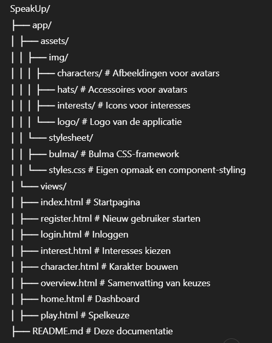

# SpeakUp 

## Projectstructuur

De projectmappen zijn als volgt georganiseerd:

## Gebruikte Technologieën

###  HTML5
Structuur en inhoud van alle pagina's.

### CSS3 + Bulma
- **Bulma** is een modern, responsief CSS-framework gebaseerd op Flexbox.
- Voorbeelden: `is-flex`, `button`, `is-fullwidth`, `has-text-centered`, enz.
- Gecombineerd met een eigen stylesheet (`styles.css`) waarin kleuren, knoppen, avatars en navigatie opgemaakt zijn.

### Font Awesome
Gebruikt voor iconen in buttons, kaarten, stappenbalk en navigatie (`<i class="fas fa-user">` etc.).

---

## Functionaliteit per view

### `interest.html`
- Gebruiker kiest **maximaal 4 interesses** (bijv. sport, muziek).
- Realtime teller (`0/4`) met JavaScript.
- Inputvelden voor favoriete boek en sport.
- Submit-knop is uitgeschakeld totdat alles geldig is.

### `character.html`
- Gebruiker kiest een basiskleur voor hun avatar.
- Vervolgens gezichten en hoeden via visuele opties.
- Avatar wordt live opgebouwd via ``-lagen.
- JavaScript update `src`-attributen van de lagen (kleur, face, hat).

### `overview.html`
- Toon gekozen interesses als iconen.
- Toon de ingevoerde voorkeuren en het opgebouwde personage.
- Bevestig om door te gaan.

### `home.html`
- Dashboard met spelgeschiedenis.
- Knop om een nieuw spel te starten (via `play.html`).

### `play.html`
- Lijst met spellen (Debate, Balloon Debate, Vocab Quiz, Role Play).
- Elke knop bevat tekst, kleur en een Font Awesome icoon.

---

## JavaScript Overzicht

- 📌 **interests:** telt geselecteerde interesses, schakelt de knop in/uit.
- 📌 **character builder:** verandert live het karakterbeeld op basis van keuze.
- 📌 Alle selecties worden visueel gemarkeerd met `.selected`.
- Geen frameworks, enkel **vanilla JavaScript** gebruikt voor eenvoud en controle.

---

## Werking

1. **Startpagina (`index.html`)**
    - Kies voor 'New User' of 'Login' (via `form` met `POST`).

2. **Registreren**
    - Gebruiker gaat stap voor stap door:
        - Interesses
        - Character
        - Overzicht

3. **Home & Spellen**
    - Na bevestiging komt de gebruiker op het dashboard.
    - Kan vanaf daar spellen starten.

---

## Designprincipes

- **Mobile-first** ontworpen.
- Donker kleurenschema (paars en verloopkleuren).
- Grote knoppen, duidelijke navigatie.
- Ondersteuning voor visuele keuzes i.p.v. alleen tekst.

---

## Mogelijke uitbreiding

- LocalStorage voor tijdelijke opslag van keuzes.
- Backend-integratie met Node.js of Flask.
- Scoretracking en gebruikersprofielen.
- Animaties bij avatarbouw en spelinteracties.

---
